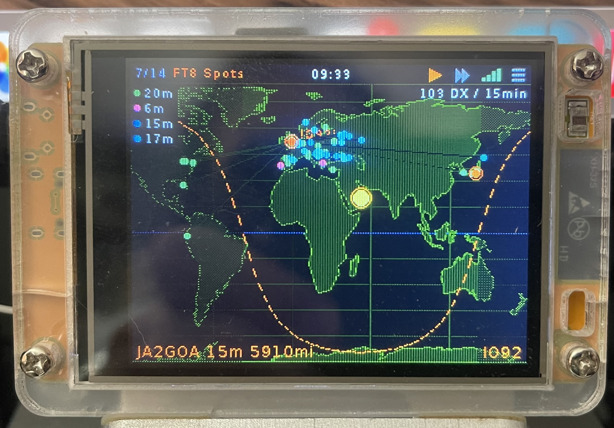

# CYD Dashboard

A multi-screen information dashboard for the ESP32 Cheap Yellow Display (CYD), built with PlatformIO and LovyanGFX. Designed primarily for amateur radio operators, it also displays weather, news, and financial data.

See [History.txt](History.txt) for the full version history and changelog.

## Screenshots

| | | |
|:---:|:---:|:---:|
|  |  |  |
| Clock | Weather | HF Conditions |
|  |  |  |
| Propagation | ISS Tracker | PSK Reporter |
|  |  |  |
| FT8 Spots | DX Spots | POTA Spots |
|  |  |  |
| SOTA Spots | Contests | BBC News |
|  |  | &nbsp; |
| Apple/Tech News | Tracker | &nbsp; |

## Screens

The dashboard cycles through 14 screens, each auto-refreshing on its own schedule:

| Screen | Description | Data Source | Refresh |
|--------|-------------|-------------|---------|
| **Clock** | Large digital clock with date, timezone, moon phase (real photo texture), and sunrise/sunset | NTP (pool.ntp.org) | Continuous |
| **Weather** | 7-day forecast with animated weather icons | Open-Meteo API | 10 min |
| **HF Conditions** | HF propagation bar chart by band; tap any index tile for an explanation overlay | HamQSL solar XML | 15 min |
| **Propagation** | Solar flux, K-index, A-index, band conditions | HamQSL solar XML | 15 min |
| **ISS Tracker** | Day/night world map with terminator, sun, QTH, and ISS ground track; shows next ISS pass details | Calculated | Continuous |
| **PSK Reporter** | Who's hearing your signal — auto-zoomed map with spots | PSK Reporter API | 2 min |
| **FT8 Spots** | What stations near you are hearing — unique DX callsigns heard by receivers in your grid square | PSK Reporter API (by grid) | 2 min |
| **DX Spots** | Nearby DX cluster spots sorted by distance | DXLite (G7VJR) | 60 s |
| **POTA Spots** | Parks on the Air activations sorted by distance | POTA API | 60 s |
| **SOTA Spots** | Summits on the Air activations sorted by distance | SOTA API | 60 s |
| **Contests** | Active and upcoming contest calendar | WA7BNM Contest Calendar | 60 min |
| **BBC News** | Top 4 headlines with thumbnail images | BBC RSS | 10 min |
| **Apple/Tech News** | Top 4 headlines with thumbnails | MacRumors RSS | 10 min |
| **Tracker** | Stock/crypto price chart (S&P 500, Bitcoin, etc.) | Yahoo Finance | 2 min |

## Hardware

- **Board:** ESP32-2432S028 "Cheap Yellow Display" (ESP32 + 2.8" 320×240 ILI9341 + XPT2046 touch)
- **Flash:** 4 MB (custom partition: 1.875 MB app + 2 MB SPIFFS, no OTA)
- **Power:** USB — the board draws up to ~400 mA during WiFi transmit

## Display Compatibility

The "Cheap Yellow Display" name covers several board variants with different display and touch controllers. The firmware is configured for the most common variant (ESP32-2432S028 with ILI9341 + XPT2046), but adapting it to other variants only requires editing `include/lgfx_config.h`.

### Step 1 — Identify your chips

There are two chips to identify:

**Display controller** — look at the small IC nearest the flat-flex ribbon cable connector on the back of the board. The most common markings are:
- `ILI9341` — 2.8" 320×240, the most common CYD display (used on this board)
- `ST7789` — found on some 2.4" and 2.8" variants
- `ILI9488` — 3.5" 320×480 variants

**Touch controller** — look at the small IC on the *front* of the PCB (the side with the USB connector). The part number is usually laser-engraved on the top of the chip:
- `XPT2046` or `ADS7846` — resistive touch, the most common CYD touch chip
- `GT911` — capacitive touch (glass surface, no pressure needed)
- `CST816S` — capacitive touch, found on some newer variants
- `FT5206` / `FT5x06` — capacitive touch, less common

### Step 2 — Match your chips to LovyanGFX driver classes

Open `include/lgfx_config.h` and change the four class declarations near the top of the `LGFX` class to match your hardware:

| Chip found on board | LovyanGFX class to use |
|---|---|
| ILI9341 (display) | `lgfx::Panel_ILI9341` |
| ST7789 (display) | `lgfx::Panel_ST7789` |
| ILI9488 (display) | `lgfx::Panel_ILI9488` |
| XPT2046 / ADS7846 (touch) | `lgfx::Touch_XPT2046` |
| GT911 (touch) | `lgfx::Touch_GT911` |
| CST816S (touch) | `lgfx::Touch_CST816S` |
| FT5206 / FT5x06 (touch) | `lgfx::Touch_FT5x06` |

The lines to change in `lgfx_config.h` are:

```cpp
lgfx::Panel_ILI9341  _panel_instance;   // ← change to match your display chip
lgfx::Touch_XPT2046  _touch_instance;   // ← change to match your touch chip
```

### Step 3 — Check the pin assignments

Most 2.8" CYD boards share the same wiring, but verify against the table below if your display is blank or your touch doesn't respond:

| Signal | Pin (standard CYD28) | Notes |
|--------|----------------------|-------|
| Display SCLK | 14 | HSPI |
| Display MOSI | 13 | HSPI |
| Display MISO | 12 | HSPI |
| Display DC | 2 | Data/Command select |
| Display CS | 15 | |
| Backlight | 21 | PWM via `Light_PWM` |
| Touch SCLK | 25 | VSPI |
| Touch MOSI | 32 | VSPI |
| Touch MISO | 39 | VSPI (input-only GPIO) |
| Touch CS | 33 | |
| Touch IRQ | 36 | Input-only GPIO |

If your board has different silkscreen labels, update the `cfg.pin_*` lines in the `_bus_instance` and `_touch_instance` config blocks accordingly.

> **Capacitive touch (GT911, CST816S, FT5x06):** these use I²C rather than SPI. Replace the `spi_host`, `pin_sclk`, `pin_mosi`, `pin_miso`, and `pin_cs` lines with:
> ```cpp
> cfg.i2c_port = 0;
> cfg.pin_sda  = 33;   // check your board's silkscreen
> cfg.pin_scl  = 32;
> cfg.i2c_addr = 0x5D; // GT911: 0x5D or 0x14; CST816S: 0x15; FT5x06: 0x38
> cfg.freq     = 400000;
> ```

### Step 4 — Fix display or touch orientation problems

If the image is **upside-down or mirrored**, change `offset_rotation` in the panel config block:

```cpp
cfg.offset_rotation = 0;  // try 0, 1, 2, or 3
```

If **touches are rotated or mirrored** relative to what's shown, change `offset_rotation` in the touch config block (values 0–7 cover all combinations of rotation and axis swap — see the comments in `lgfx_config.h` for what each value does).

If colours look **wrong (red and blue swapped)**, set:

```cpp
cfg.rgb_order = true;
```

### Step 5 — Run touch calibration

After any hardware change, go to **Settings > Touch Calibrate** on the device to recalibrate the touch screen for your specific unit. The calibration is saved to flash and survives reboots.

## Status Bar

The status bar sits at the top of every screen:

- **Left** — current screen number/total and name, e.g. `3/13 HF Conditions`
- **Centre** — local time (`HH:MM`); tap to jump to the Clock screen
- **Right** — four tap targets, evenly spaced:
  - ⏯ **Play/Pause** — toggle auto-advance
  - **▸▸ Advance** — jump to the next enabled screen immediately
  - **WiFi bars** — signal strength (0–4 bars); tap to show an overlay with SSID, IP address, MAC address, and RSSI
  - **☰ Menu** — open on-device Settings

## Features

- **Touch navigation** — swipe left/right to change screens, or use the status bar buttons (auto-advance no longer triggers on a content-area tap, so screens like PSK Reporter and Contests can use taps for their own interactions)
- **Auto-play** — screens cycle automatically (8 seconds each, 16s on the Clock); toggle with the play/pause button
- **Moon phase display** — the Clock screen shows a real lunar photograph (41×41 px RGB565, stored in PROGMEM) masked to the current phase, so the lit portion shows actual surface detail
- **ISS pass prediction** — the ISS Tracker screen shows a "Next ISS Pass" box in the bottom-left corner with rise and set times, azimuth bearings, pass duration, and peak elevation. The prediction uses the same analytical orbital model as the ground track, scanning up to 5 days ahead. When the ISS is currently above 5° the box turns green and reads "ISS VISIBLE NOW". When the next pass is more than 24 hours away a compact single-line date is shown instead
- **ISS Pass Alert** — an optional setting (Settings > ISS Pass Alert, default on) that automatically jumps to the ISS Tracker screen the moment the ISS rises above 5° from your QTH, and holds there until the pass ends. Normal auto-scroll then resumes. Press the Play/Pause button during a pass to exit the hold early
- **HF index overlays** — on the HF Conditions screen, tap any index tile (SFI, SSN, A, K, or X-Ray) to see a pop-up explaining the value range, the ideal, what the index means, and its effect on HF propagation. Auto-scroll pauses while the overlay is open; tap anywhere to dismiss
- **WiFi info overlay** — tap the WiFi bars in the status bar to see the connected SSID, IP address, MAC address, and signal strength. Tap anywhere to dismiss
- **Touch calibration** — Settings > Touch Calibrate runs a 4-point crosshair calibration (powered by LovyanGFX) and persists the result to flash
- **Automatic timezone detection** — saving a new grid locator in Settings > Location triggers a background lookup (via Open-Meteo's timezone resolver) that matches your coordinates to the correct timezone and applies it automatically; falls back to a manual prompt if no match is found
- **Live location updates** — changing the grid locator immediately resets the Weather screen to its loading state and forces a fresh fetch for the new coordinates, rather than showing stale data for the old location
- **Screen brightness control** — Settings > Brightness provides a draggable slider and four quick-select presets (25% / 50% / 75% / 100%). The change takes effect immediately and is saved to flash. Reducing brightness can help with flickering on USB-powered boards
- **Unit preferences** — Settings > Distance Units (mi / km) and Temperature (C / F) are independent toggles. Distance Units also controls wind speed (mph / km/h) on the Weather screen. Changing either setting triggers an immediate weather re-fetch so the Open-Meteo API returns data in the correct unit. Distances on DX Spots, POTA Spots, SOTA Spots, and PSK Reporter convert at display time with no re-fetch needed
- **PSK Reporter** — animated pulsing markers for your furthest and loudest reception spots, with a tap-to-inspect overlay showing callsign, country, grid, band, SNR, and distance; the map auto-zooms to fit your QTH and all current spots while preserving correct aspect ratio (letterboxed if needed)
- **FT8 Spots** — the reverse of PSK Reporter: instead of who hears *you*, it maps the DX stations that receivers in your grid square are hearing, deduplicated by callsign keeping the strongest report. Tap the furthest (orange) or loudest (green) station for a details overlay; tap any other spot to embolden its band in the legend, which helps when the band colours are hard to tell apart. The legend auto-positions itself to whichever corner covers the fewest spots
- **Mode filter** — filter DX, POTA, and SOTA spots by mode (CW, Voice, FT8, FT4, Digital, Other) from Settings > Mode Filter
- **Contest detail** — tap any contest to fetch mode, bands, and exchange requirements from contestcalendar.com, with word-wrapping for long exchange formats and a clear error state if the lookup fails
- **High-resolution coastlines** — world map uses Natural Earth 50m data at half-degree resolution
- **Animated loading states** — "Fetching..." / "Loading..." messages animate with cycling dots instead of sitting static, and failed fetches (PSK Reporter, contest details) show an explicit error rather than spinning forever
- **WiFi credentials** — configure via captive portal on first boot, or place `data/wifi.txt` (SSID on line 1, password on line 2)
- **Efficient memory management** — mbedTLS is built with an asymmetric TLS record buffer (`CONFIG_MBEDTLS_SSL_OUT_CONTENT_LEN=4096`), cutting the contiguous heap a handshake needs from 33434 to 16717 bytes; every response is parsed as it streams off the socket rather than buffered whole, so memory use does not scale with response size

## Building

### Prerequisites

- [PlatformIO Core](https://platformio.org/) (CLI, or the VSCode/CLion plugin)
- A USB cable to the CYD board
- ~2 GB free disk — the first build downloads ESP-IDF 4.4.5 and its toolchain

### VS Code

Open `cyd-dashboard.code-workspace` (**File > Open Workspace from File...**). It
sets sensible defaults and recommends the PlatformIO extension.

Preconfigured tasks are available via **Terminal > Run Task** (Build is also
bound to the default build shortcut):

| Task | What it does |
|------|--------------|
| PlatformIO: Build | Compile |
| PlatformIO: Upload | Compile and flash |
| PlatformIO: Monitor | Serial log at 115200 |
| PlatformIO: Regenerate sdkconfig and build | Deletes `sdkconfig.esp32dev` first — use after editing `sdkconfig.defaults` |
| PlatformIO: Upload File System | Flash SPIFFS (see the warning below) |

These call PlatformIO's bundled interpreter explicitly rather than whatever
`pio` resolves to on your PATH — so it is that interpreter which needs the
`setuptools<81` fix below.

### One-time setup: restore `pkg_resources`

This project pins `platform = espressif32@5.4.0` (see *Toolchain notes* below).
That platform's build script imports Python's `pkg_resources`. Two independent
changes have since removed it — Python 3.12 dropped the implicit bundling, and
**setuptools removed the module outright in v81** — so on a current toolchain
every build fails immediately with:

```
ModuleNotFoundError: No module named 'pkg_resources'
```

Fix it once, for whichever Python runs `pio`:

```bash
# Which interpreter is it?  (look at the "Python" line)
pio system info

# PlatformIO's bundled environment — the usual case
~/.platformio/penv/bin/python -m pip install "setuptools<81"
```

The `<81` bound matters and is not cosmetic. Measured on Python 3.14.5:

| setuptools | `import pkg_resources` |
|-----------:|------------------------|
| 83.0.0     | ModuleNotFoundError |
| 80.10.2    | works |
| 75.9.1     | works |

Note the `pio` on your PATH and PlatformIO's bundled `~/.platformio/penv/bin/pio`
are often **different interpreters** — fixing one does not fix the other. The
VS Code tasks in this repo all call the bundled one, so that is the one worth
fixing first.

> A PlatformIO core update can replace the bundled interpreter and silently undo
> this. If the error reappears after updating PlatformIO, just run the install
> again.

### Build, flash, monitor

```bash
# Build only
~/.platformio/penv/bin/pio run

# Build and upload firmware
~/.platformio/penv/bin/pio run --target upload

# Watch the serial log (115200 baud)
~/.platformio/penv/bin/pio device monitor
```

If the board is not auto-detected, pass the port explicitly:

```bash
~/.platformio/penv/bin/pio run --target upload --upload-port /dev/cu.usbserial-XXXXXXX
```

(Plain `pio` works too, once that interpreter has `setuptools<81` installed.
Windows: `%USERPROFILE%\.platformio\penv\Scripts\pio.exe`.)

The first build compiles all of ESP-IDF and takes roughly 15–20 minutes.
Later builds are ~10 seconds.

### Uploading WiFi credentials via SPIFFS (optional)

```bash
~/.platformio/penv/bin/pio run --target uploadfs
```

> **Warning:** this rewrites the whole SPIFFS partition, which also holds your
> saved **touch calibration**. You will need to re-run Touch Calibrate from
> Settings afterwards. Prefer the captive portal (see *First boot*) unless you
> specifically need to preload `data/wifi.txt`.

### Toolchain notes

Two things about this project's build are unusual and easy to break:

**1. The platform version is pinned deliberately.** `platformio.ini` sets
`platform = espressif32@5.4.0` with `framework = arduino, espidf`. A combined
Arduino + ESP-IDF build requires both frameworks to be built against the *same*
ESP-IDF, and 5.4.0 is the newest release where that holds (Arduino 2.0.6 and
framework-espidf 4.4.5 are both IDF 4.4.x). **Every 6.x release** pairs an
IDF-4.4-based Arduino core with framework-espidf 5.x, which cannot be combined.
Do not bump the pin without re-checking that pairing.

The combined build exists so `sdkconfig.defaults` actually takes effect — under
plain `framework = arduino`, mbedTLS ships **prebuilt** and no setting in
`platformio.ini` can reconfigure it.

**2. Editing `sdkconfig.defaults` alone does nothing.** It only *seeds* the
generated `sdkconfig.esp32dev` on first build. To change any `CONFIG_*` value:

```bash
rm sdkconfig.esp32dev
~/.platformio/penv/bin/pio run
```

`sdkconfig.esp32dev` is generated and gitignored; `sdkconfig.defaults` is the
source of truth.

### Troubleshooting

**`ModuleNotFoundError: No module named 'pkg_resources'`**
Install `setuptools<81` into the interpreter running `pio` — see *One-time
setup* above. If it worked before and suddenly broke, a PlatformIO core update
probably replaced the bundled interpreter; run the install again.

**A `CONFIG_*` change in `sdkconfig.defaults` had no effect**
Delete `sdkconfig.esp32dev` and rebuild.

**Board boots to `[wifi] trying ...` then the serial port disappears**
Not a firmware fault. WiFi radio init draws ~300 mA; if the USB port is
current-limited the rail collapses and takes the USB-serial chip off the bus
with it. The tell is the *serial device* vanishing rather than a panic or
backtrace. Unplug and replug, try a different port or cable, or use a powered
hub. This is most likely after several flashes in quick succession.

**`Error: The program size ... is greater than maximum allowed`**
`board_build.partitions = partitions.csv` is missing from `platformio.ini`. The
partition table is needed in *both* `platformio.ini` (what the size check reads)
and `sdkconfig.defaults` (what actually gets flashed).

**Compile fails on a warning**
`-Werror=all` is on deliberately and the project builds warning-clean. Fix the
warning rather than adding `build_unflags` to silence it.

### First boot

1. The board creates a WiFi access point called **CYD-Dashboard**
2. Connect to it with a phone or laptop
3. Open **192.168.4.1** in a browser
4. Select your WiFi network and enter the password
5. The board restarts and connects to your network

Alternatively, create `data/wifi.txt` with your SSID on line 1 and password on line 2, then upload SPIFFS before first boot.

### Configuration

Tap the ☰ menu icon at the right of the status bar to open on-device settings. The menu is alphabetically ordered and scrollable (sidebar with up/down arrows and a drag thumb):

- **Brightness** — drag slider or use presets to set backlight level; takes effect immediately
- **Callsign** — your amateur radio callsign (used for PSK Reporter)
- **Distance Units** — mi or km; also controls wind speed units (mph / km/h) on the Weather screen
- **ISS Pass Alert** — auto-jump to ISS Tracker when the ISS is visible from your QTH (only shown when the ISS Tracker screen is enabled)
- **Location** — 6-character Maidenhead grid locator (used for distance calculations, map position, and weather). Saving a new grid automatically detects and applies the correct timezone
- **Mode Filter** — toggle CW, Voice, FT8, FT4, Digital, and Other modes for the DX/POTA/SOTA spot screens
- **Screens** — enable/disable individual screens
- **Temperature** — C or F; independent of Distance Units
- **Timezone** — select from 22 common timezones, or let Location auto-detect it for you
- **Touch Calibrate** — run if touches don't line up with what's displayed
- **Tracker** — choose stock/crypto symbol and chart range (1–5 years)

## Project Structure

```
include/
  config.h              Screen IDs, API URLs, timing, colour palette
  data_store.h          Shared data structures for all screens
  settings.h            Persistent settings and mode filter defines
  moon_texture.h        41×41 RGB565 moon photograph (PROGMEM, ~3.4 KB flash)
  screen_*.h            Per-screen headers
  lgfx_config.h         LovyanGFX display/touch configuration
  fonts/                Custom font headers (Akzidenz Grotesk)
src/
  main.cpp              Setup, touch handling, screen cycling, ISS pass alert
  ui.cpp                Sprite management, status bar, WiFi overlay, draw dispatch
  fetch.cpp             Background fetch task (core 1), all API calls, ISS pass prediction
  settings.cpp          SPIFFS load/save, grid-to-lat/lon, mode classification
  screen_*.cpp          Per-screen rendering
data/
  wifi.txt              WiFi credentials (SSID + password, gitignored)

cyd-dashboard.code-workspace   VS Code workspace (settings + recommended extensions)
.vscode/tasks.json      Build / Upload / Monitor tasks
platformio.ini          Platform pin, framework, build flags — see Toolchain notes
sdkconfig.defaults      ESP-IDF config; source of truth for all CONFIG_* values
                        (delete the generated sdkconfig.esp32dev to re-apply)
partitions.csv          4 MB layout: 1.94 MB app0 + 2 MB SPIFFS, no OTA
```

## Data Sources

All data is fetched from free, public APIs with no API keys required:

- **Weather & timezone lookup:** [Open-Meteo](https://open-meteo.com/)
- **Solar/HF:** [HamQSL](https://www.hamqsl.com/)
- **ISS position:** [Open Notify](http://open-notify.org/)
- **DX Spots:** [DXLite by G7VJR](http://dxlite.g7vjr.org/)
- **POTA:** [Parks on the Air API](https://pota.app/)
- **SOTA:** [SOTA API](https://www.sota.org.uk/)
- **Contests:** [WA7BNM Contest Calendar](https://www.contestcalendar.com/)
- **PSK Reporter:** [PSK Reporter](https://pskreporter.info/)
- **News:** BBC RSS, MacRumors RSS
- **Stocks:** Yahoo Finance chart API
- **Thumbnails:** [wsrv.nl](https://wsrv.nl/) image proxy for resizing

## Licence

This project is provided as-is for personal and educational use.
