# CYD Dashboard

A multi-screen information dashboard for the ESP32 Cheap Yellow Display (CYD), built with PlatformIO and LovyanGFX. Designed primarily for amateur radio operators, it also displays weather, news, and financial data.

See [History.txt](History.txt) for the full version history and changelog.

## Screenshots

| | | |
|:---:|:---:|:---:|
| 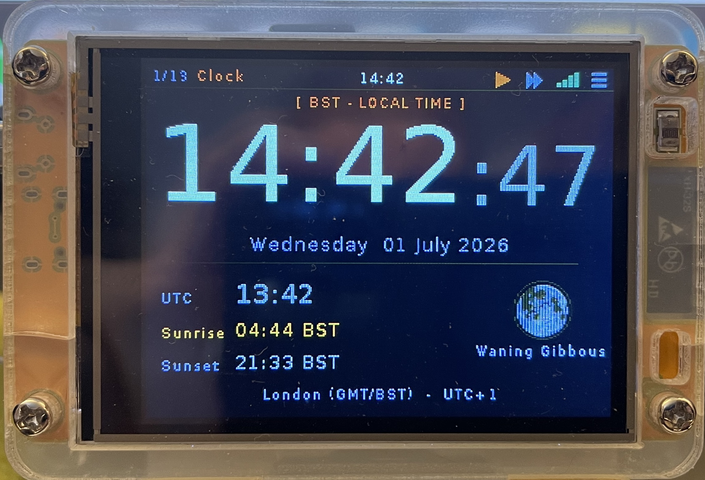 | 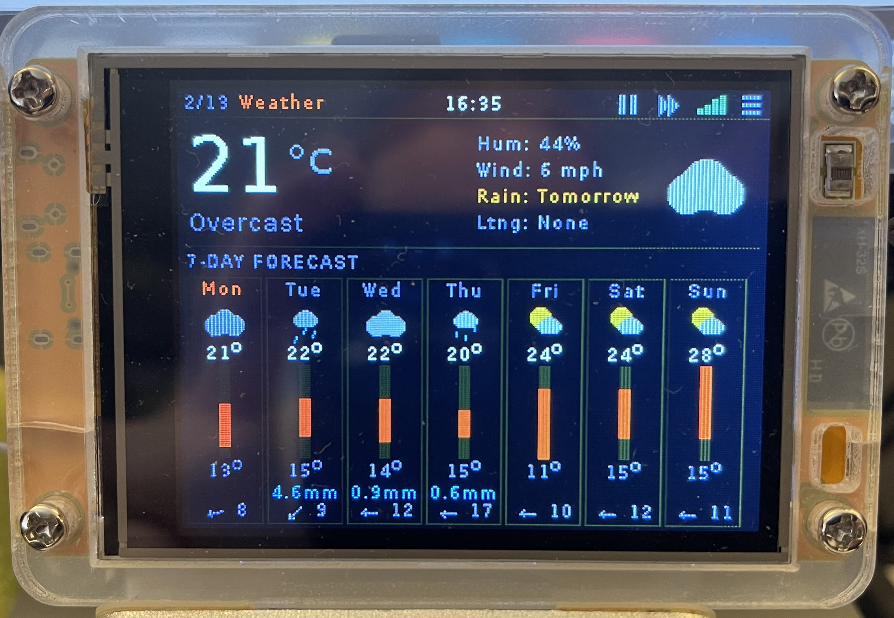 | 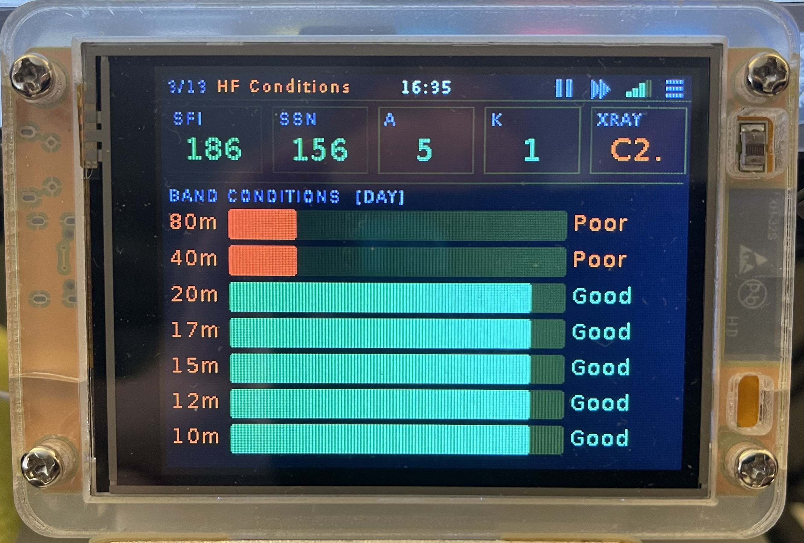 |
| Clock | Weather | HF Conditions |
| 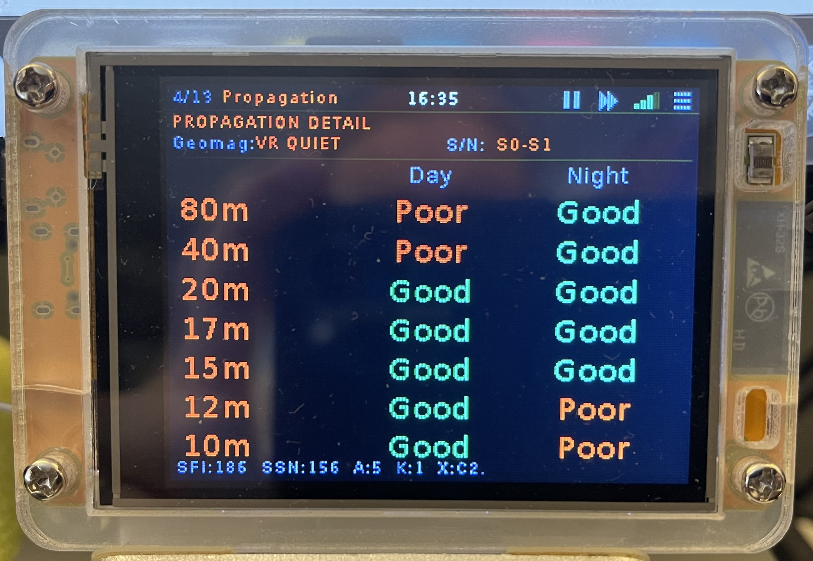 | 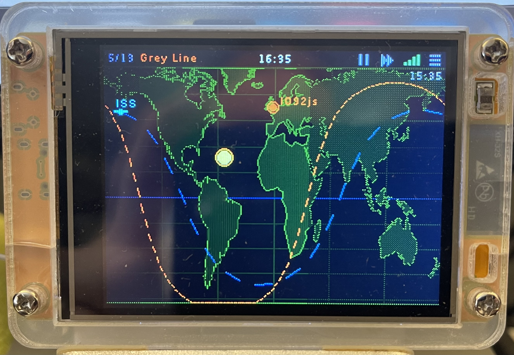 | 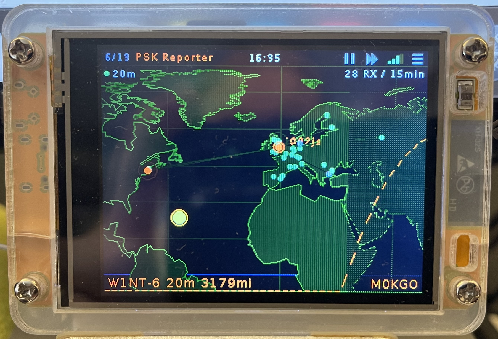 |
| Propagation | Grey Line | PSK Reporter |
| 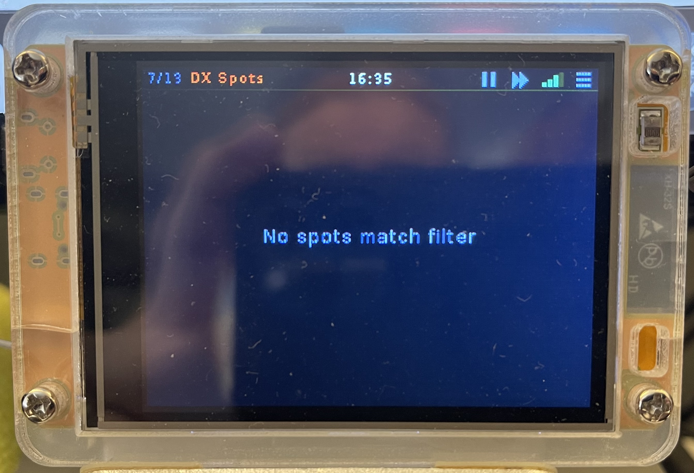 | 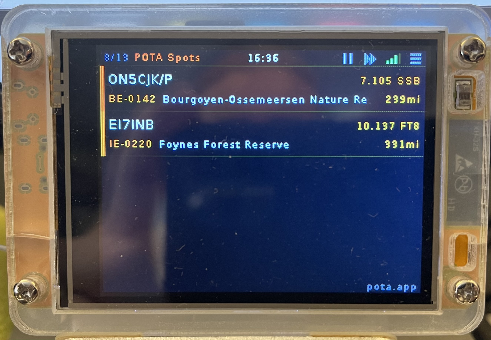 | 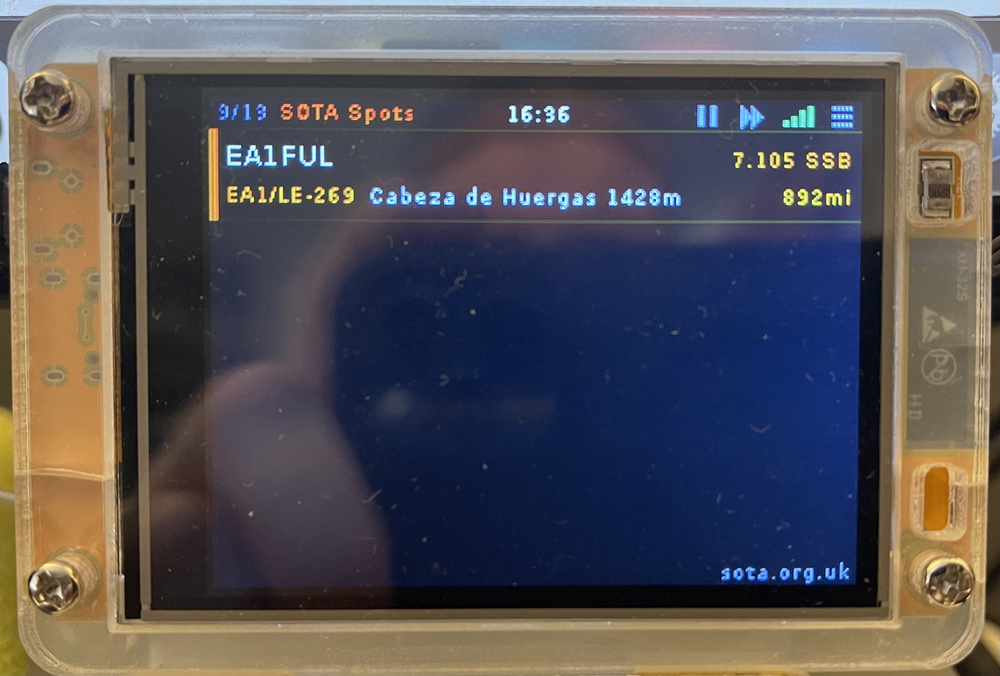 |
| DX Spots | POTA Spots | SOTA Spots |
| 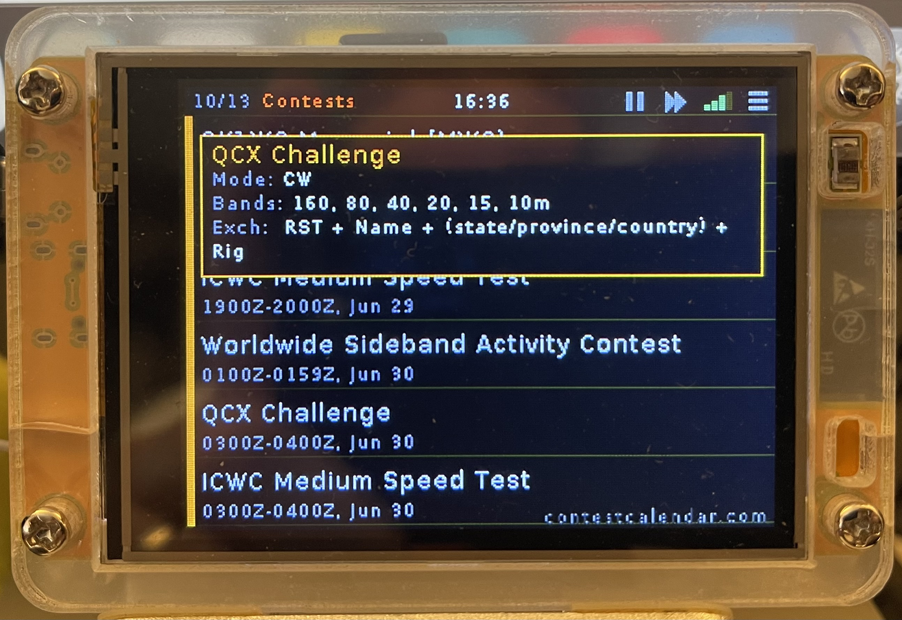 | 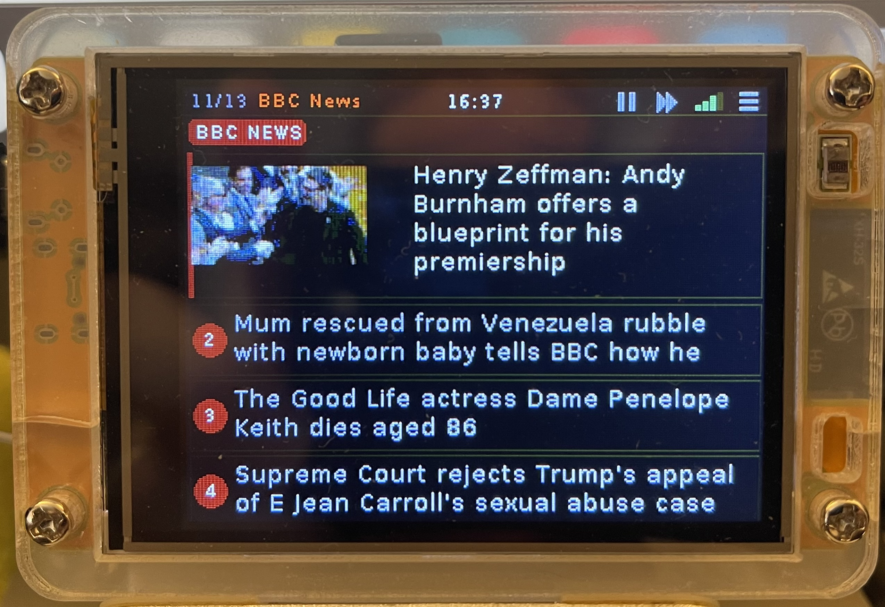 | 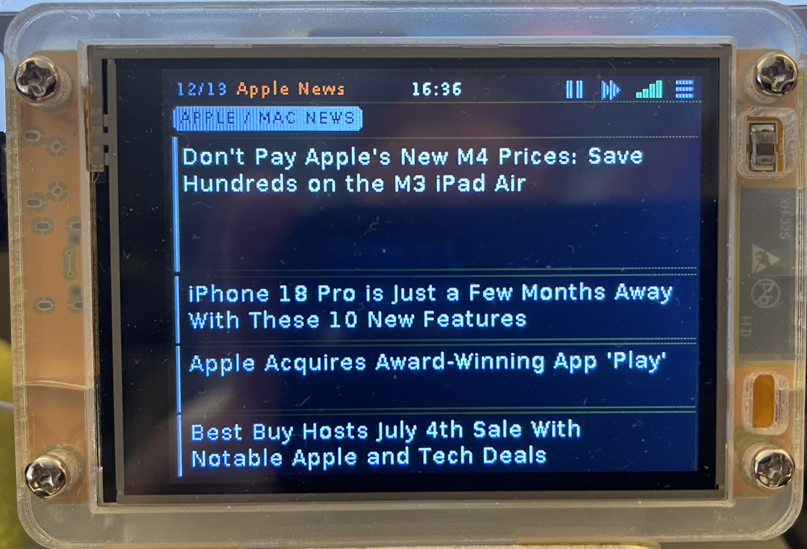 |
| Contests | BBC News | Apple/Tech News |
| 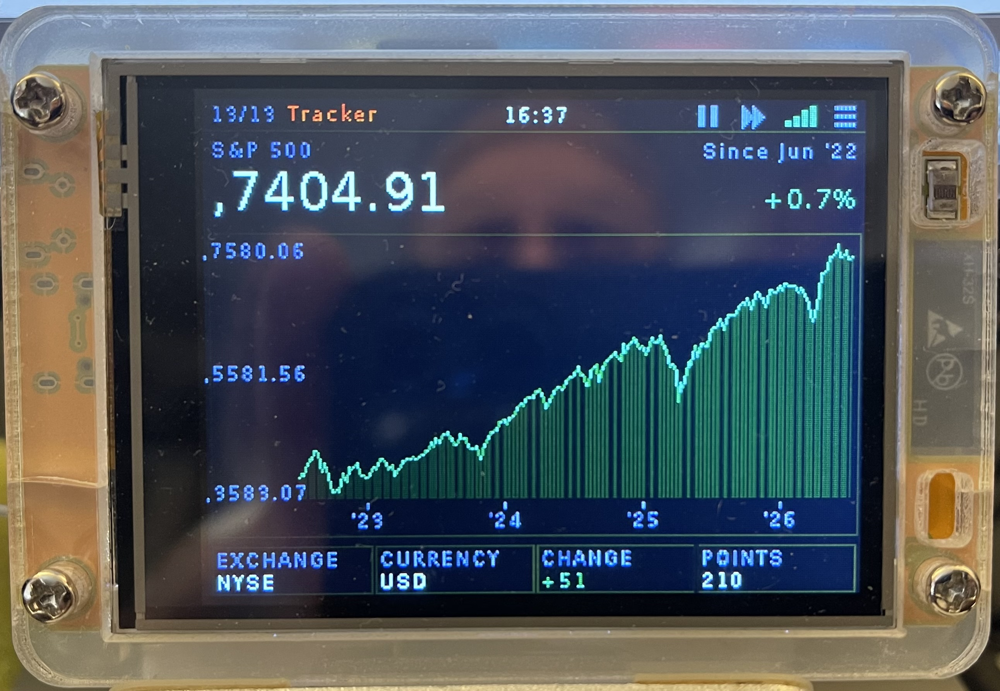 | &nbsp; | &nbsp; |
| Tracker | &nbsp; | &nbsp; |

## Screens

The dashboard cycles through 13 screens, each auto-refreshing on its own schedule:

| Screen | Description | Data Source | Refresh |
|--------|-------------|-------------|---------|
| **Clock** | Large digital clock with date and timezone | NTP (pool.ntp.org) | Continuous |
| **Weather** | 7-day forecast with animated weather icons | Open-Meteo API | 10 min |
| **HF Conditions** | HF propagation bar chart by band | HamQSL solar XML | 15 min |
| **Propagation** | Solar flux, K-index, A-index, band conditions | HamQSL solar XML | 15 min |
| **Grey Line** | Day/night world map with terminator, sun, and QTH | Calculated | Continuous |
| **PSK Reporter** | Who's hearing your signal — auto-zoomed map with spots | PSK Reporter API | 2 min |
| **DX Spots** | Nearby DX cluster spots sorted by distance | DXLite (G7VJR) | 60 s |
| **POTA Spots** | Parks on the Air activations sorted by distance | POTA API | 60 s |
| **SOTA Spots** | Summits on the Air activations sorted by distance | SOTA API | 60 s |
| **Contests** | Active and upcoming contest calendar | WA7BNM Contest Calendar | 60 min |
| **BBC News** | Top 4 headlines with thumbnail images | BBC RSS | 10 min |
| **Apple/Tech News** | Top 4 headlines with thumbnails | MacRumors RSS | 10 min |
| **Tracker** | Stock/crypto price chart (S&P 500, Bitcoin, etc.) | Yahoo Finance | 2 min |

## Hardware

- **Board:** ESP32-2432S028 "Cheap Yellow Display" (ESP32 + 2.8" 320x240 ILI9341 + XPT2046 touch)
- **Flash:** 4 MB (custom partition: 1.875 MB app + 2 MB SPIFFS, no OTA)
- **Power:** USB — the board draws up to ~400 mA during WiFi transmit

## Status Bar

The status bar sits at the top of every screen:

- **Left** — current screen number/total and name, e.g. `3/13 HF Conditions`
- **Centre** — local time (`HH:MM`)
- **Right** — four tap targets, evenly spaced:
  - ⏯ **Play/Pause** — toggle auto-advance
  - **▸▸ Advance** — jump to the next enabled screen immediately
  - **WiFi bars** — signal strength (0-4 bars; tap has no action)
  - **☰ Menu** — open on-device Settings

## Features

- **Touch navigation** — swipe left/right to change screens, or use the status bar buttons (auto-advance no longer triggers on a content-area tap, so screens like PSK Reporter and Contests can use taps for their own interactions)
- **Auto-play** — screens cycle automatically (8 seconds each, 16s on the Clock); toggle with the play/pause button
- **Touch calibration** — Settings > Touch Calibrate runs a 4-point crosshair calibration (powered by LovyanGFX) and persists the result to flash
- **Automatic timezone detection** — saving a new grid locator in Settings > Location triggers a background lookup (via Open-Meteo's timezone resolver) that matches your coordinates to the correct timezone and applies it automatically; falls back to a manual prompt if no match is found
- **Live location updates** — changing the grid locator immediately resets the Weather screen to its loading state and forces a fresh fetch for the new coordinates, rather than showing stale data for the old location
- **PSK Reporter** — animated pulsing markers for your furthest and loudest reception spots, with a tap-to-inspect overlay showing callsign, country, grid, band, SNR, and distance; the map auto-zooms to fit your QTH and all current spots while preserving correct aspect ratio (letterboxed if needed)
- **Mode filter** — filter DX, POTA, and SOTA spots by mode (CW, Voice, FT8, FT4, Digital, Other) from Settings > Mode Filter
- **Contest detail** — tap any contest to fetch mode, bands, and exchange requirements from contestcalendar.com, with word-wrapping for long exchange formats and a clear error state if the lookup fails
- **High-resolution coastlines** — world map uses Natural Earth 50m data at half-degree resolution
- **Animated loading states** — "Fetching..." / "Loading..." messages animate with cycling dots instead of sitting static, and failed fetches (PSK Reporter, contest details) show an explicit error rather than spinning forever
- **WiFi credentials** — configure via captive portal on first boot, or place `data/wifi.txt` (SSID on line 1, password on line 2)
- **Efficient memory management** — SSL buffers are pre-reserved and released around each HTTPS call to avoid heap fragmentation on the ESP32's 320 KB DRAM

## Building

### Prerequisites

- [PlatformIO](https://platformio.org/) (CLI or IDE plugin)
- USB cable connected to the CYD board

### Build and flash

```bash
# Build and upload firmware
pio run --target upload

# Upload SPIFFS data (wifi.txt)
pio run --target uploadfs
```

### First boot

1. The board creates a WiFi access point called **CYD-Dashboard**
2. Connect to it with a phone or laptop
3. Open **192.168.4.1** in a browser
4. Select your WiFi network and enter the password
5. The board restarts and connects to your network

Alternatively, create `data/wifi.txt` with your SSID on line 1 and password on line 2, then upload SPIFFS before first boot.

### Configuration

Tap the ☰ menu icon at the right of the status bar to open on-device settings:

- **Location** — 6-character Maidenhead grid locator (used for distance calculations, map position, and weather). Saving a new grid automatically detects and applies the correct timezone.
- **Timezone** — select from 22 common timezones, or let Location auto-detect it for you
- **Screens** — enable/disable individual screens
- **Tracker** — choose stock/crypto symbol and chart range (1-5 years)
- **Callsign** — your amateur radio callsign (used for PSK Reporter)
- **Mode Filter** — toggle CW, Voice, FT8, FT4, Digital, and Other modes for the DX/POTA/SOTA spot screens
- **Touch Calibrate** — run if touches don't line up with what's displayed

## Project Structure

```
include/
  config.h              Screen IDs, API URLs, timing, colour palette
  data_store.h          Shared data structures for all screens
  settings.h            Persistent settings and mode filter defines
  screen_*.h            Per-screen headers
  lgfx_config.h         LovyanGFX display/touch configuration
  fonts/                Custom font headers (Akzidenz Grotesk)
src/
  main.cpp              Setup, touch handling, screen cycling
  ui.cpp                Sprite management, status bar, draw dispatch
  fetch.cpp             Background fetch task (core 1), all API calls
  settings.cpp          SPIFFS load/save, grid-to-lat/lon, mode classification
  screen_*.cpp          Per-screen rendering
data/
  wifi.txt              WiFi credentials (SSID + password, gitignored)
```

## Data Sources

All data is fetched from free, public APIs with no API keys required:

- **Weather & timezone lookup:** [Open-Meteo](https://open-meteo.com/)
- **Solar/HF:** [HamQSL](https://www.hamqsl.com/)
- **ISS position:** [Open Notify](http://open-notify.org/)
- **DX Spots:** [DXLite by G7VJR](http://dxlite.g7vjr.org/)
- **POTA:** [Parks on the Air API](https://pota.app/)
- **SOTA:** [SOTA API](https://www.sota.org.uk/)
- **Contests:** [WA7BNM Contest Calendar](https://www.contestcalendar.com/)
- **PSK Reporter:** [PSK Reporter](https://pskreporter.info/)
- **News:** BBC RSS, MacRumors RSS
- **Stocks:** Yahoo Finance chart API
- **Thumbnails:** [wsrv.nl](https://wsrv.nl/) image proxy for resizing

## Licence

This project is provided as-is for personal and educational use.
